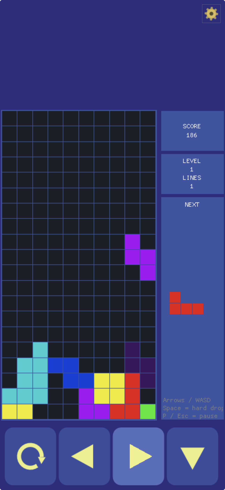
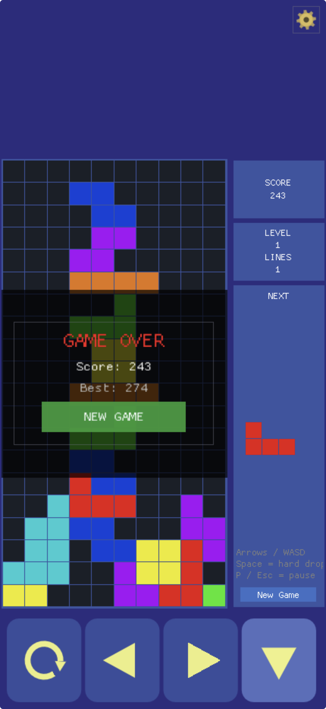

# BlockFall

A fully playable **falling block puzzle game** built with [Sokol.NET](../../README.md).

> **Tetris® Notice**: *Tetris* is a registered trademark of The Tetris Company, LLC. BlockFall is an independent implementation of the falling block puzzle genre and is not affiliated with, endorsed by, or licensed by The Tetris Company.

## Screenshots

| Gameplay | Game Over |
|----------|-----------|
|  |  |

This example demonstrates:
- 2D rendering with `sokol_gp` (SGP painter API)
- ImGui-based score panel, settings popup, and animated gear button
- Draw-list vector icons for touch buttons (no font assets required, works on Web/WASM)
- Cross-platform audio via `sokol_audio` + NVorbis OGG decoding
- Keyboard key-repeat with safe frame-dequeuing
- Virtual d-pad for mobile and web touch input
- Persistent high-score storage via local app data

## Gameplay

| Key | Action |
|-----|--------|
| ← / A | Move left |
| → / D | Move right |
| ↓ / S | Soft drop |
| ↑ / W | Rotate |
| Space | Hard drop |
| P / Escape | Pause / resume |
| N / Enter | New game (when game over) |

On **mobile and web**, four touch buttons appear at the bottom of the screen: Rotate, Left, Right, and Soft Drop.

## Features

- **Gameplay** — standard falling-block rules (inspired by Tetris™): 7 tetrominoes, wall kicks, ghost piece, soft/hard drop, level progression (speed increases every 10 lines), line-clear scoring
- **Rendering** — SGP 2D fills for board cells and panel boxes; ImGui for all overlaid text and UI
- **Audio** — background music loop, line-clear SFX, lock SFX, game-over sting
- **Settings** — animated gear button (top-right corner) opens a settings popup; pauses the game while open. Contains a Music toggle.
- **Touch buttons** — draw-list vector icons (triangles + arc) rendered directly on the ImGui draw list; no TTF font loading required, works identically on Desktop, iOS, Android, and Web
- **High score** — saved to `LocalApplicationData/BlockFall/highscore.txt`; shown as "NEW BEST!" on game over when beaten

## Project Files

| File | Purpose |
|------|---------|
| [Source/BlockFall-app.cs](Source/BlockFall-app.cs) | Main app: rendering, ImGui UI, input, layout, settings |
| [Source/TetrisGame.cs](Source/TetrisGame.cs) | Pure game logic: board, pieces, scoring, level |
| [Source/AudioManager.cs](Source/AudioManager.cs) | OGG loading + mixing via `saudio_push`; music loop |
| [Source/FileSystem.cs](Source/FileSystem.cs) | Cross-platform async/sync asset loading |
| [Source/Program.cs](Source/Program.cs) | `sapp_desc` entry point |

## Build and Run

```bash
# Desktop (macOS / Windows / Linux)
dotnet run -p BlockFall.csproj

# WebAssembly
dotnet run -p BlockFallWeb.csproj
```

For iOS, Android, and detailed platform workflows see the workspace docs: [../../docs](../../docs).

## Assets

### Audio

All audio files are located in [`Assets/`](Assets/) and were sourced from [Pixabay](https://pixabay.com/) — royalty-free downloads.

| File | Event |
|------|-------|
| `music.ogg` | Background music loop |
| `clear.ogg` | Line clear sound effect |
| `impact.ogg` | Piece lock sound effect |
| `GameEnd.ogg` | Game over sting |

**License:** Pixabay grants a royalty-free license for use in commercial and non-commercial projects without attribution required. See the [Pixabay Content License](https://pixabay.com/service/license-summary/) for full terms.

> Note: if you redistribute this project or publish it to an app store, the audio files should be replaced with assets you own outright, or you must verify that Pixabay's license terms cover your specific distribution channel.

### App Icons

The logo images in `Assets/` (`logo_full_large.png`, etc.) are part of the Sokol.NET project assets.

## Dependencies

| Library | License | Notes |
|---------|---------|-------|
| [sokol](https://github.com/floooh/sokol) | zlib/libpng | Core graphics, audio, fetch |
| [sokol_gp](https://github.com/edubart/sokol_gp) | MIT | 2D painter API |
| [Dear ImGui](https://github.com/ocornut/imgui) | MIT | UI rendering |
| [NVorbis](https://github.com/NVorbis/NVorbis) | MIT | OGG/Vorbis decoding |
| Audio assets | [Pixabay License](https://pixabay.com/service/license-summary/) | Royalty-free, see above |

---

← Back to [Sokol.NET](../../README.md)
