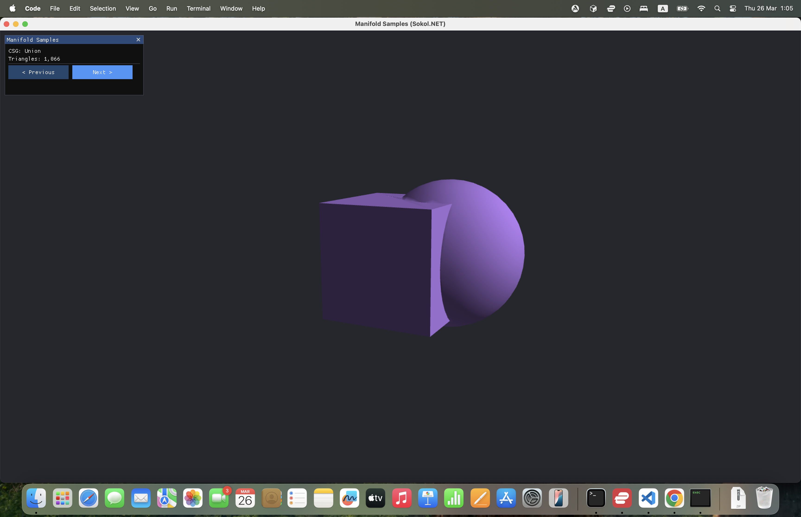
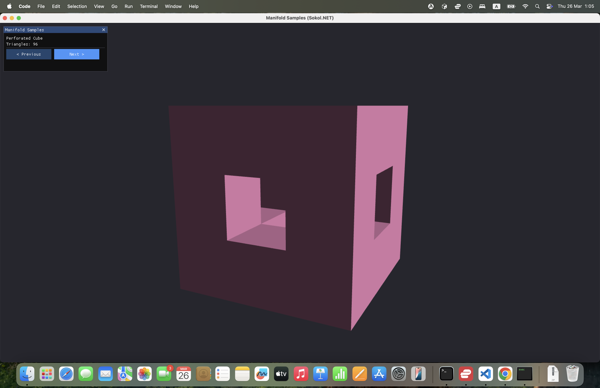
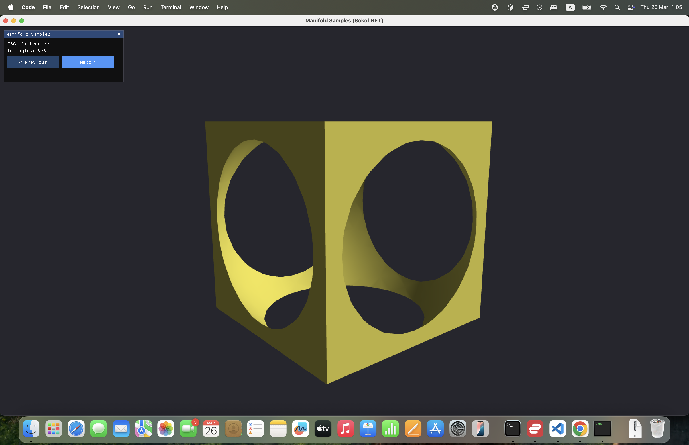
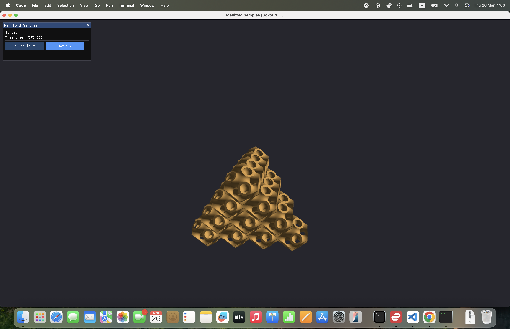
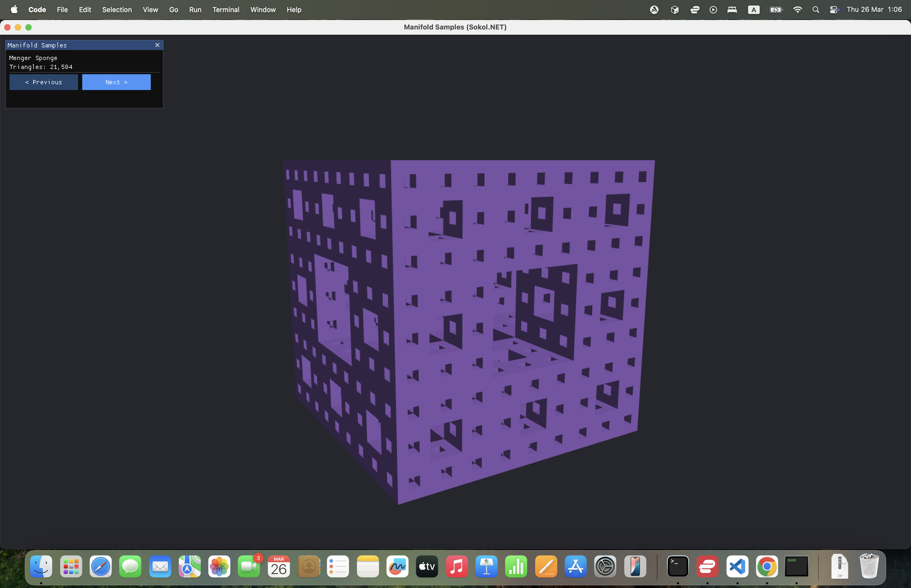
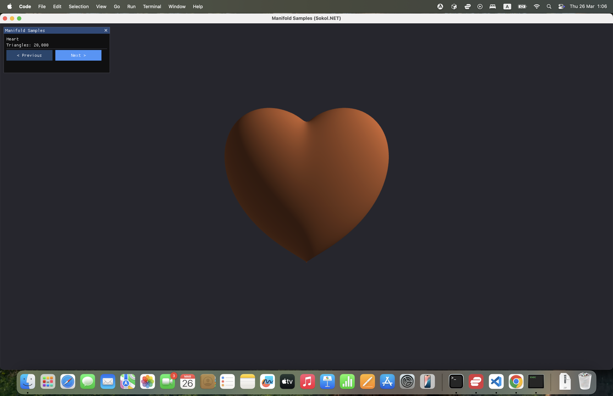
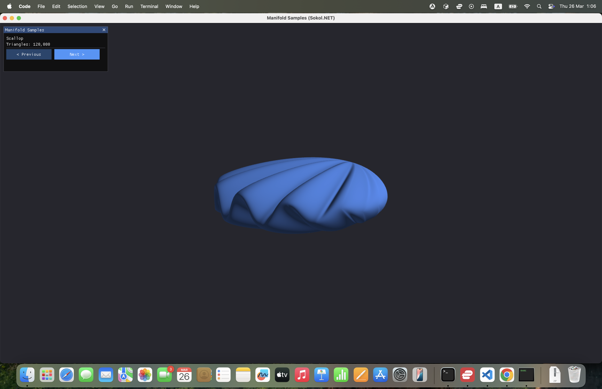

# ManifoldApp

An interactive 3D CSG (Constructive Solid Geometry) demo for Sokol.NET powered by the [Manifold](https://github.com/elalish/manifold) geometry library.

Browse 18 procedural shapes and CSG operations — each built entirely in C# using the Manifold C bindings — with real-time ImGui controls and smooth per-frame rotation.

## 🌐 Live Demo

**[Try it in your browser →](https://elix22.github.io/Sokol.NET/)**

## 📸 Screenshots

| CSG: Union | CSG: Difference |
|:---:|:---:|
|  |  |

| Perforated Cube | Menger Sponge |
|:---:|:---:|
|  |  |

| Gyroid | Heart |
|:---:|:---:|
|  |  |

| Scallop | |
|:---:|:---:|
|  | |

## 📋 Samples

| # | Name | Description |
|---|------|-------------|
| 0 | **Tetrahedron** | Primitive regular tetrahedron |
| 1 | **Cube** | Unit cube |
| 2 | **Sphere** | High-tessellation sphere (64 segments) |
| 3 | **Cylinder** | Centered cylinder |
| 4 | **CSG: Union** | Cube + offset sphere merged with boolean union |
| 5 | **CSG: Difference** | Cube with sphere carved out |
| 6 | **Perforated Cube** | Cube with 3 axis-aligned bars subtracted (level-1 Menger sponge) |
| 7 | **Wireframe Cube** | 12 edge cylinders + 8 corner spheres batch-unioned |
| 8 | **Torus** | Revolved circle cross-section at a major radius |
| 9 | **Rounded Frame** | Cube frame with rounded edges — `split()` + re-union, based on the Manifold JS example |
| 10 | **Twisted Column** | Square cross-section extruded with 180° twist and surface smoothing |
| 11 | **Menger Sponge** | Recursive fractal cube at depth 3 (all 3 axes) |
| 12 | **Gyroid** | Gyroid modular puzzle piece built using SDF level sets inside a rhombic dodecahedron |
| 13 | **Auger** | 3-bead helical screw — quarter-torus beads extruded with twist |
| 14 | **Heart** | Sphere warped via Newton's method to Taubin's implicit heart surface |
| 15 | **Torus Knot** | Trefoil knot (p=1, q=3) — revolved tube warped along a torus-knot path |
| 16 | **Scallop** | Fan mesh with selective halfedge sharpening and smooth subdivision |
| 17 | **Stretchy Bracelet** | Toroidal band with warp-deformed surface |

## 🎮 Controls

- **Sample selector** — ImGui combo box to switch between shapes
- **Rotation** — model auto-rotates each frame; built on the main render loop
- **"Building..."** indicator — on Desktop/iOS/Android, geometry is computed on a background thread so the UI stays responsive during heavy builds (Gyroid, Menger Sponge, Torus Knot)

## 🔧 Architecture

### Geometry Pipeline

1. **Build** — C# code calls the [Manifold C API](https://github.com/elalish/manifold/tree/master/bindings/c) to construct geometry using primitives, boolean operations, extrusions, revolutions, and SDF level sets.
2. **Extract** — `ExtractMesh` converts `MeshGL` to an interleaved GPU vertex buffer (`[x, y, z, nx, ny, nz]` per vertex) with crease-angle smooth normals (60° threshold, area-weighted).
3. **Upload** — vertex and index buffers are streamed into Sokol GFX dynamic buffers each rebuild.
4. **Render** — a Phong-lit shader (compiled with sokol-shdc for all backends) renders the mesh with per-sample accent colors.

### Normal Computation

Normals are computed entirely in C# using a flat prefix-sum adjacency structure (no `Dictionary` / GC boxing):

- Adjacent faces within 60° → smooth shared normal (good for spheres, cylinders, splines)
- Adjacent faces beyond 60° → hard split vertex (preserves sharp cube edges, CSG seams)
- Area-weighted accumulation for numerically stable smooth groups

### Background Threading (`#if !WEB`)

On native platforms, `BuildSample` runs on a background thread with a volatile 3-state machine:

```
0 = idle  →  1 = building  →  2 = result ready
```

The main thread polls state `2` each frame and uploads the pre-computed geometry. On WebAssembly, geometry is computed synchronously (no thread support).

### Shader

The GLSL shader (`shaders/manifold-sapp.glsl`) provides:
- Blinn-Phong lighting with a fixed overhead light
- Per-sample accent color uniform
- Compiled for Metal, HLSL, GLSL (100/330/300es), and WGSL via sokol-shdc

## 🏗️ Building

### Desktop

```bash
cd examples/ManifoldApp
dotnet build ManifoldApp.csproj -t:CompileShaders
dotnet build ManifoldApp.csproj
dotnet run -p ManifoldApp.csproj
```

### WebAssembly

```bash
cd examples/ManifoldApp
dotnet publish ManifoldAppWeb.csproj
```

### Android / iOS

Use VS Code tasks (`Cmd+Shift+P` → **Tasks: Run Task**):
- `prepare-ManifoldApp` — Desktop
- `prepare-ManifoldApp-web` — WebAssembly

## 📦 Dependencies

| Library | Purpose |
|---------|---------|
| [Manifold](https://github.com/elalish/manifold) | Robust 3D boolean operations, CSG, SDF level sets, mesh extrusion/revolution/warp |
| [Sokol GFX](https://github.com/floooh/sokol) | Cross-platform GPU rendering (Metal, D3D11, OpenGL, WebGL) |
| [Dear ImGui](https://github.com/ocornut/imgui) via cimgui | Immediate-mode GUI for sample selector and status overlay |

The Manifold native library (`libmanifoldc.dylib` / `manifoldc.dll` / `libmanifoldc.so` / `manifoldc.a`) is built from the [`ext/manifold`](../../ext/manifold) submodule and pre-committed for all platforms via a GitHub Actions workflow.

## 📁 Project Structure

```
ManifoldApp/
├── Source/
│   ├── ManifoldApp-app.cs   # All geometry builders + render loop
│   └── Program.cs           # Entry point
├── shaders/
│   └── manifold-sapp.glsl   # Phong-lit shader (sokol-shdc)
├── ManifoldApp.csproj        # Desktop/iOS/Android project
├── ManifoldAppWeb.csproj     # WebAssembly project
└── README.md
```

## 🔗 References

- [Manifold geometry kernel](https://github.com/elalish/manifold)
- [Manifold JS wasm examples](https://elalish.github.io/manifold/playground/) — several samples (Auger, Rounded Frame, Gyroid, Torus Knot, Scallop) are C# ports of these reference implementations
- [Sokol.NET](../../README.md)
